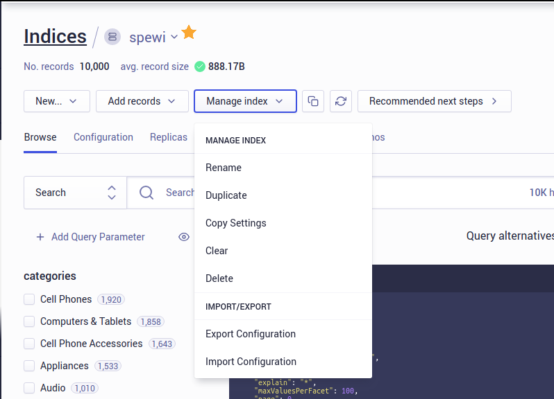

*Question 1*  

 
From: marissa@startup.com  
Subject:  Bad design  

Hello,  
  
Sorry to give you the kind of feedback that I know you do not want to hear, but I really hate the new dashboard design. Clearing and deleting indexes are now several clicks away. I am needing to use these features while iterating, so this is inconvenient.  
   
Thanks,  
Marissa  

  
--

Hi Marissa,

Thanks for reaching out with your feedback. 

If you're working with multiple indexes, if you click the small down arrow (where the star is) while on the Indices part of the dashboard, it will expand into a dropdown listing all of your indexes. This makes it easy to switch between indexes.

To clear, delete, or otherwise manage an index, you can click Manage Index and select the option you want from the dropdown. You should be able to manage an index with just two clicks.

The dashboard UI changes can take some getting used to, but hopefully this helps make it easier to use. I'm also going to link some of our dashboard navigation documentation [here](https://www.algolia.com/doc/guides/getting-started/quick-start/tutorials/getting-started-with-the-dashboard/#dashboard-navigation) in case you're curious about some of the other options that are also available. Let me know if you have any questions!

Best,\
Freya

*Question 2*:   
  
From: carrie@coffee.com  
Subject: URGENT ISSUE WITH PRODUCTION!!!!  
  
Since today 9:15am we have been seeing a lot of errors on our website. Multiple users have reported that they were unable to publish their feedbacks and that an alert box with "Record is too big, please contact enterprise@algolia.com".  
  
Our website is an imdb like website where users can post reviews of coffee shops online. Along with that we enrich every record with a lot of metadata that is not for search. I am already a paying customer of your service, what else do you need to make your search work?  
  
Please advise on how to fix this. Thanks.   

  
--

Hi Carrie,

Algolia limits the size of a record for performance reasons, with the limit depending on your plan. When records are too large, we usually address this by either upgrading your plan or decreasing the record size. 

In this case, I suggest decreasing the record size by removing the metadata attributes from your data before sending it. We recommend sending just the data used for searching, displaying, ranking so that records only contain necessary information. [This](https://www.algolia.com/doc/guides/sending-and-managing-data/prepare-your-data/how-to/reducing-object-size/#removing-unused-attributes) goes into detail and includes examples in case you find it helpful.

Let me know if you have any questions!

Best,\
Freya

*Question 3*:   

From: marc@hotmail.com  
Subject: Error on website  
  
Hi, my website is not working and here's the error:  
  
  
  
Can you fix it please?  

--

Hi Marc,

It looks like searchkit is being used before it's defined. You should require it or import it globally on the page.

Hope that helps!

Best,\
Freya